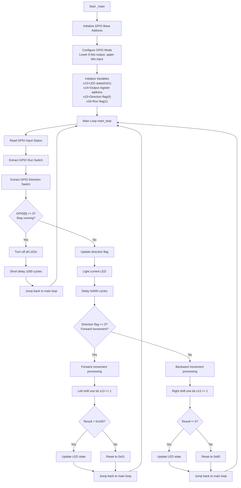
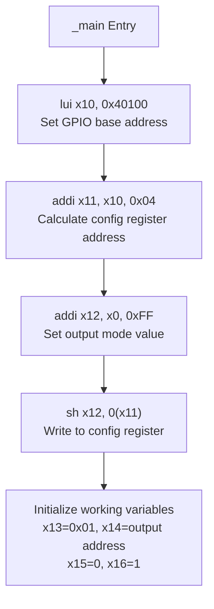
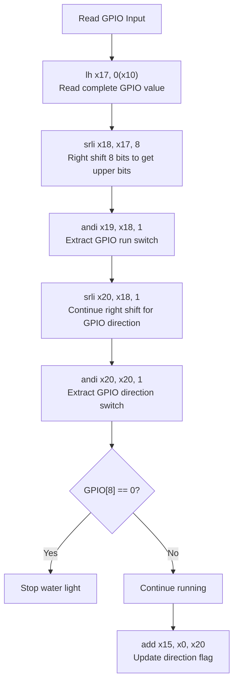
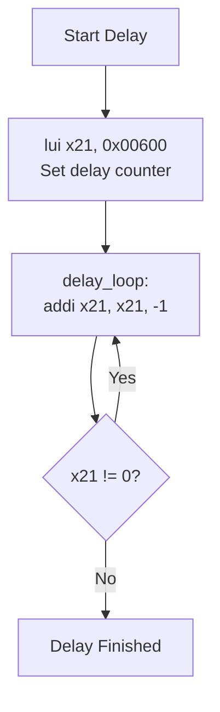
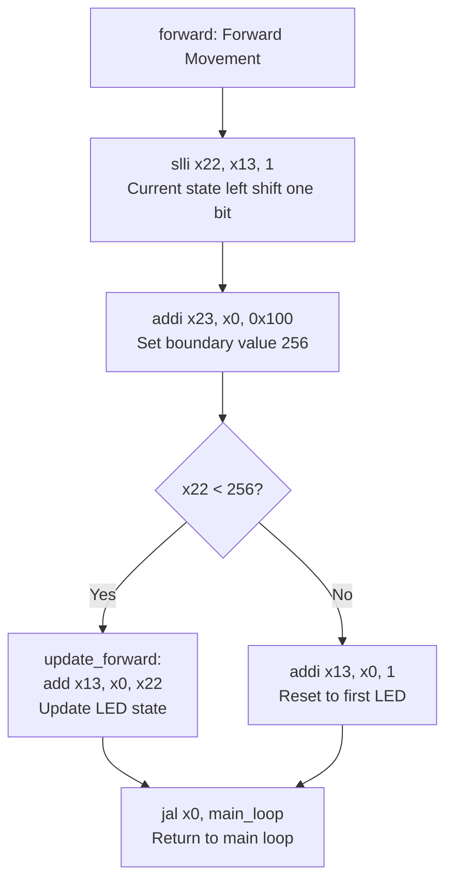
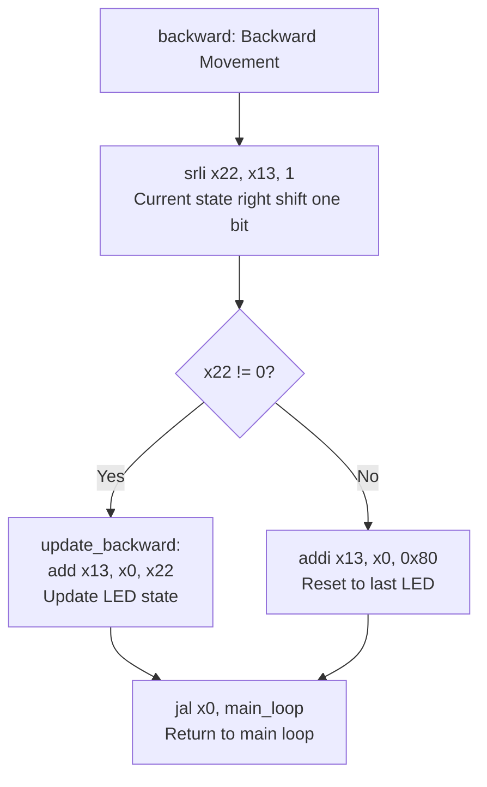
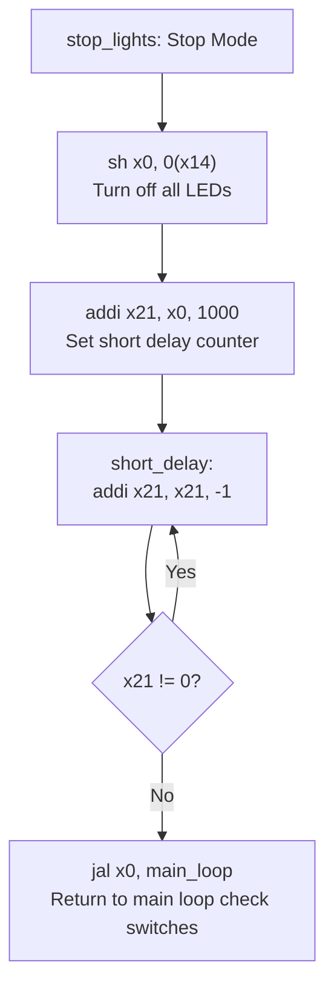

# Water Light Program Flowchart

RV32I assembly program flowchart based on `waterlight.s` file.

## Overall Program Flow

## Detailed Functional Modules

### 1. Initialization Module

### 2. GPIO Read and Control Logic

### 3. Delay Module

### 4. Forward Movement Logic

### 5. Backward Movement Logic

### 6. Stop Mode

## Register Usage Description

| Register | Purpose                      | Description                            |
| -------- | ---------------------------- | -------------------------------------- |
| x10      | GPIO Base Address            | 0x40100000                             |
| x11      | GPIO Config Register Address | x10 + 0x04                             |
| x12      | Config Value                 | 0xFF (lower 8 bits output)             |
| x13      | Current LED State            | Bit pattern indicating which LED is on |
| x14      | GPIO Output Register Address | x10 + 0x02                             |
| x15      | Direction Flag               | 0=forward, 1=backward                  |
| x16      | Run Flag                     | 0=stop, 1=run                          |
| x17      | GPIO Input Value             | Temporary storage                      |
| x18      | Processed Input Value        | Value after right shift by 8 bits      |
| x19      | GPIO[8] Status               | Run switch status                      |
| x20      | GPIO[9] Status               | Direction switch status                |
| x21      | Delay Counter                | Used for various delays                |
| x22      | Temporary LED State          | Result of shift operations             |
| x23      | Boundary Value               | Used for boundary checking             |

## Program Features

1. **Infinite Loop Design**: Program implements infinite loop through `jal x0, main_loop`
2. **Real-time Response**: Checks GPIO switch status every loop iteration
3. **Bidirectional Flow**: Supports both forward and backward flow directions
4. **Boundary Handling**: Automatically handles boundary conditions for water light
5. **Energy-saving Design**: Turns off all LEDs when stopped to reduce power consumption
6. **Precise Timing**: Delay loops designed for 1MHz clock frequency
